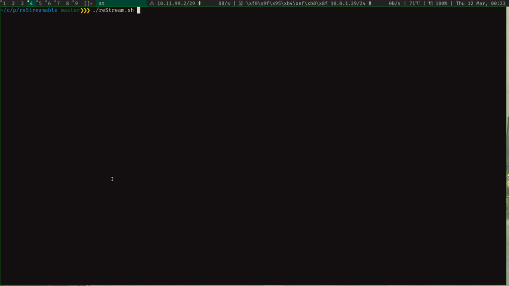

# reStream

reMarkable screen sharing over SSH.

## Installation

1. Clone this repository: `git clone https://github.com/rien/reStream`
2. (Optionally) [Install zstd on your host and reMarkable](#sub-second-latency)

## Usage

1. Connect your reMarkable with the USB cable.
2. Make sure you can [open an SSH connection](https://remarkablewiki.com/tech/ssh).
3. Run `./reStream.sh`.
4. A screen will pop-up on your local machine, with a live view of your reMarkable!

If you have problems, don't hesitate to [open an issue](https://github.com/rien/reStream/issues/new) or [send me an email](mailto:rien.maertens@posteo.be).

## Requirements

On your **host** machine:
- Any POSIX-shell (e.g. bash)
- ffmpeg (with ffplay)
- ssh

On your **reMarkable** nothing is needed, unless you want...

### Sub-second latency

To achieve sub-second latency, you'll need [lz4](https://github.com/lz4/lz4) 
on your host and on your reMarkable.

You can install `lz4` on your host with your usual package manager. On Ubuntu,
`apt install liblz4-tool` will do the trick.

On your **reMarkable** you'll need a binary of `lz4` build for the arm platform,
you can do this yourself by [installing the reMarkable toolchain](https://remarkablewiki.com/devel/qt_creator#toolchain)
and compiling `lz4` from source with the toolchain enabled, or you can use the
statically linked binary I have already built and put in this repo.

Copy the `lz4` program to your reMarkable with `scp lz4.arm.static root@10.11.99.1:~/lz4` and you're ready to go.
